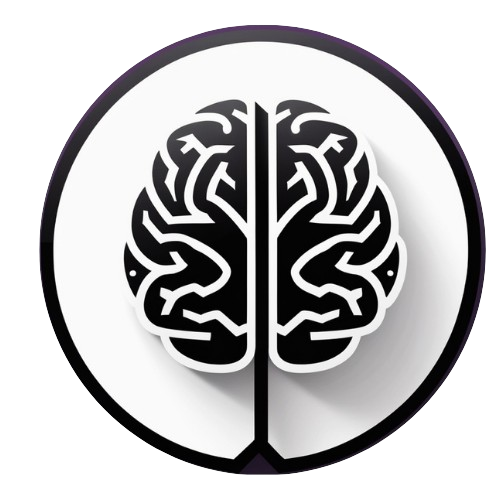

# AceMed AI 🇵🇰 

  

 
AI-powered MDCAT preparation platform tailored to PTB/Federal board syllabus using LLaMA-based fine-tuned models.

---

## 🖥️ Landing Page

### AceMed AI — Pakistan’s AI-Powered MDCAT Preparation Platform

**Crack the MDCAT — Score Higher with AI Precision**

AceMed AI is trained on exact FSC Federal, PTB, and provincial board books, offering precise, personalized preparation powered by advanced AI.

👉 [Start Free Trial](https://acemed-ai.streamlit.app/)  
👉 [Learn More](https://acemed-ai.streamlit.app/)

---

## 🌐 Navigation

- Home  
- About Us  
- Features  
- Pricing  
- FAQs  
- **Login | Register**

---

## 🎯 Key Highlights

### Why AceMed AI?

AceMed AI merges technology with education to create a personalized and efficient MDCAT prep experience. It replaces costly coaching centers with smart, adaptive tools, empowering students to:

- Learn at their own pace
- Focus on weak areas
- Practice with real-time AI feedback

**Mission:** To make high-quality MDCAT prep accessible, smart, and personalized through the power of AI.

---

AceMed AI is Pakistan’s first AI-powered MDCAT preparation assistant, trained on PTB and Federal Board books. It provides:

- ✍️ Accurate, syllabus-based answers
- 📊 Performance analytics dashboard
- 🤖 Chatbot interface for MDCAT Q&A
- 📚 Curated MCQ banks
- 🔍 Step-by-step numerical solvers
- 🔄 Adaptive learning and feedback loops

---

## 🛠️ Technology Stack

| Layer          | Tools & Frameworks                            |
|----------------|------------------------------------------------|
| **Frontend**   | Streamlit, HTML, TailwindCSS, React.js        |
| **Backend**    | FastAPI, LangChain, Python, HuggingFace       |
| **Database**   | MongoDB, Redis                                 |
| **AI Models**  | LLaMA, LoRA Fine-Tuning, Transformers          |
| **Infra**      | Google Colab Pro+, GitHub, Vercel              |

---

## 🔬 AI Model Fine-Tuning

We leverage the **LLaMA model**, fine-tuned using **LoRA (Low-Rank Adaptation)** to adapt the base language model to the **MDCAT domain**. This enables precise, context-aware responses aligned with FSc and PTB syllabi.

👉 [Open Fine-Tuning Notebook in Colab](https://colab.research.google.com/drive/19h9IH47HhXx30C2gfd7Kr6GzJwB6-2-Y)

### 📘 Fine-Tuning Overview

| Component                 | Details                                                                 |
|--------------------------|-------------------------------------------------------------------------|
| **Base Model**           | Meta LLaMA (7B)                                                         |
| **Fine-Tuning Method**   | LoRA (Low-Rank Adaptation)                                              |
| **Data Used**            | Curated PTB + Federal Board textbook content + MDCAT MCQs              |
| **Framework**            | 🤗 Hugging Face Transformers + PEFT                                     |
| **Notebook**             | Google Colab for rapid iteration                                        |
| **Training Objective**   | SFT (Supervised Fine-Tuning) on syllabus-aligned Q&A                    |
| **Epochs**               | 3–5 (adaptive based on validation loss)                                 |
| **Optimization**         | AdamW optimizer, 5e-5 learning rate                                     |
| **LoRA Ranks**           | r=8, alpha=16                                                           |
| **Hardware Used**        | Google Colab Pro+ (A100 GPU)                                            |

---

## 🔄 Development Roadmap

AceMed AI follows the **Agile Software Development Life Cycle (SDLC)** for rapid iteration, scalability, and user-focused features.

### 📅 Phases

1. **Research & Requirement Analysis**
   - Aligning features with PMC syllabus & student feedback  
   
2. **Data Collection & Preprocessing**
   - Structuring PTB/Federal board content and MCQs  
   - Cleaning & labeling data for model training  

3. **AI Model Development**
   - Fine-tuning transformer-based models  
   - Developing step-by-step numerical solvers  

4. **System Development & Integration**
   - Backend infrastructure + chatbot interface  
   - Interactive dashboard for performance analytics  

5. **Testing & Deployment**
   - Unit & integration testing  
   - Beta deployment for real-world usage  

6. **User Feedback & Iteration**
   - Feedback from students & educators  
   - Feature refinement & model accuracy tuning  

---

## 💸 Pricing

| Plan            | Price         | Features                                                                 |
|-----------------|---------------|---------------------------------------------------------------------------|
| 🎓 **Free**     | Rs 0/month    | Limited AI question generation, Basic analytics                          |
| 🥇 **Gold**     | Rs 2500/month | Unlimited AI-generated questions, Detailed performance analytics, Support |
| 👑 **Platinum** | Rs 5000/month | All Gold features, 1-on-1 mentoring, Exclusive MCQ banks                 |

---

## ❓ FAQs

**Q: How is AceMed AI different from ChatGPT?**  
A: It's trained specifically on MDCAT syllabus (Federal/PTB), ensuring relevant, accurate answers.

**Q: Can AceMed AI improve my marks?**  
A: Yes, through adaptive learning and targeted practice.

**Q: Is past paper practice included?**  
A: Yes, along with textbook references and explanations.

**Q: How accurate are the answers?**  
A: 95%+ based on internal testing. Manual reviews ongoing for edge cases.

---

## 🤝 Contribution Guidelines

AceMed AI is open-source and welcomes contributions:

1. Fork the repository  
2. Create a feature branch  
3. Commit your changes  
4. Open a pull request  

---

## 📜 License & Links

- **License**: MIT License  
- **Website**: [AceMedAI.com](https://acemedai.com)  
- **Contact**: support@acemed.ai |  

---
